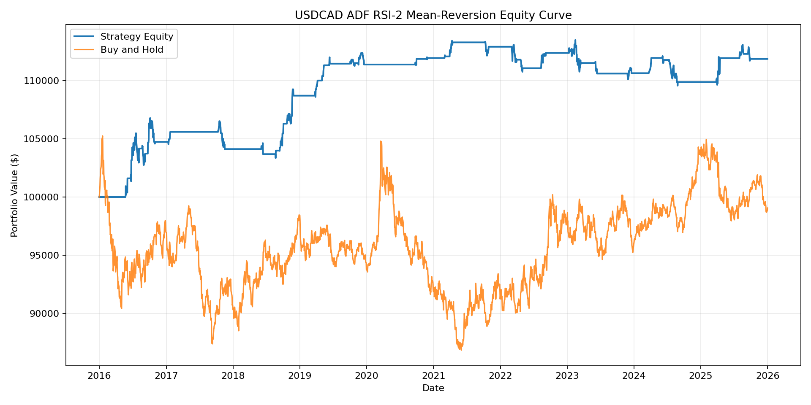

# ADF Quantitative FX Trading Strategies 📈

This repository contains a suite of algorithmic trading backtest scripts focusing on mean-reversion strategies applied to major FX pairs (EURUSD, GBPUSD, USDCAD, USDJPY). 

A core component of all three strategies is the use of the **Augmented Dickey-Fuller (ADF) test**. Trades are only executed when the statistical test confirms the market is currently in a mean-reverting (stationary) regime, filtering out strong trending periods where mean-reversion tends to fail.

## Data Source

The backtests in this repository are designed to process **daily BFIX (Bloomberg FX Fixings) OHLC (Open, High, Low, Close)** pricing data. 

*(Note: To run these scripts locally, you must provide your own historical BFIX data in `.xlsx` format and place it in the root directory).*

## Strategies Included

1. **`01_bollinger_reversion.py`**
   Uses Bollinger Bands to define overbought/oversold levels. 

2. **`02_price_action.py`**
   Focuses on consecutive down/up days (streaks) combined with percentile ranking within a recent rolling price range. 

3. **`03_rsi_reversion.py`**
   Utilizes the highly reactive Connors RSI-2 indicator. It enters long on extreme RSI lows (<10) and short on extreme RSI highs (>90), provided the ADF test confirms stationarity.

## Example Equity Curve

Below is the equity curve generated by the **RSI-2 Strategy** on the EURUSD pair between 2016 and 2026, comparing the strategy's equity against a simple buy-and-hold benchmark.



## Installation & Setup

To run these backtests locally, clone the repository and install the dependencies:

```bash
git clone [https://github.com/wilsonng27/fx-adf-quant-strategies.git](https://github.com/wilsonng27/fx-adf-quant-strategies.git)
cd fx-adf-quant-strategies
pip install -r requirements.txt
